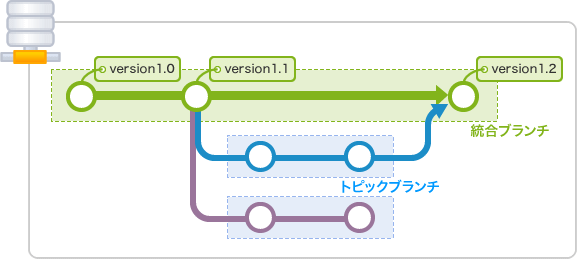
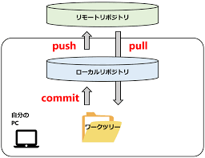

# Git・GitHub　について
##　gitについて
- Gitとは、ソースコードの変更履歴を管理するための分散型バージョン管理システムです。
- 書いたコードをここにいちど保存しておくことで、書いたコードがパソコン上で破損してしまったときにコードを復元することができたりどのように変更したのかなどの履歴を確認することができます。
##　githubについて
- GitHubとは、Gitを使用したソースコードの管理や共有を行うためのWebサービスです。
- githubにVScodeからコミットすることで、VSCode上で書いたコードをgithub上に保存することができます。

## gitとgithubのちがいについて
- gitはソースコードの変更履歴を管理するためのツールで、githubはそのツールを使ってソースコードを管理・共有するためのWebサービスです。
- gitはローカル環境で動作し、githubはインターネット上で動作します。

## git,githubを使うにあたっての必要知識
-コミット、プッシュ、プル、ブランチなどの基本的な概念を理解することが重要です。
-コミットとは、変更したコードをローカルリポジトリに保存することです。
-プッシュとは、ローカルリポジトリの変更をリモートリポジトリに反映することです。
-プルとは、リモートリポジトリの変更をローカルリポジトリに反映することです。

-ブランチとは、複数の開発者が同時に作業できるようにするための機能です。
